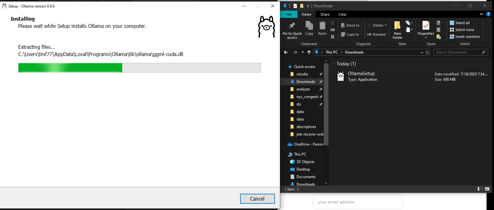

# README `/query_ai`

## ✅ Goal

Run a free, local LLM (e.g., LLaMA, Mistral, or Gemma) and query it from R using httr or curl via an API exposed on your machine.

🥇 Easiest: Use Ollama

> Zero setup, works on Mac/Windows/Linux, local GPU or CPU, and exposes a REST API.


## 🔧 1. Install Ollama (takes 1 minute)

Go to: https://ollama.com/download

Install the app (it runs in the background and exposes a local API)

 


## Set Ollama to PATH

Second, you'll want to find the path to the `ollama` program, and add it to your PATH. This will allow you to run the ollama command from any directory, by just typing `ollama <your subsequent commands here>` in the terminal.

Note: If you get "command not found" error, this is because Git Bash doesn't automatically recognize the `ollama` command.

Fortunately, our repository has a project specific `.bashrc` file that we can load in once per session to set all the command paths.

Update your `.bashrc` script to include the following line (or equivalent):

```bash
export PATH="$PATH:/c/Users/<yournetid>/AppData/Local/Programs/Ollama"
```

Now run your `.bashrc` in the terminal as:

```bash
source .bashrc
ollama --version # now this will work!
```


💾 2. Pull a Model

```bash
ollama run gemma3
```

 

> Other options: llama2, gemma, codellama, phi, etc.


🚀 3. Run the Model

Just type:

```bash
ollama run mistral
```

Or just have it idle in the background — the REST API stays live.


---

🧪 4. Query Ollama from R

Here’s an R script that just works, assuming ollama is running:

```r
library(httr2)
library(jsonlite)

res <- request("http://localhost:11434/api/generate") %>%
  req_body_json(list(
    model = "mistral",
    prompt = "Explain systems engineering in two sentences.",
    stream = FALSE
  )) %>%
  req_method("POST") %>%
  req_perform()

output <- resp_body_json(res)
cat(output$response)
```

> ✅ Works out of the box
✅ Cross-platform
✅ No API key, no credentials, no Python
✅ You can install it in labs, give students a portable script, or run in class


---

# Further Learning

🥈 LM Studio (GUI) + Localhost API

GUI app to run models locally (e.g., GGUF versions of Mistral, LLaMA2)

Also exposes a local API on port 1234

Slightly more manual but no CLI required

URL: https://lmstudio.ai

